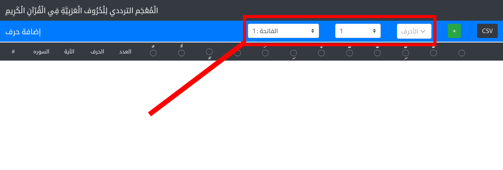
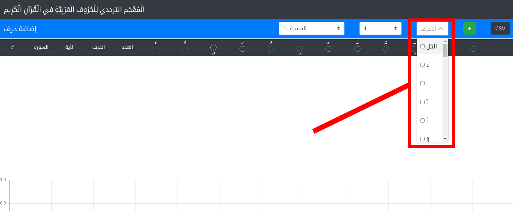
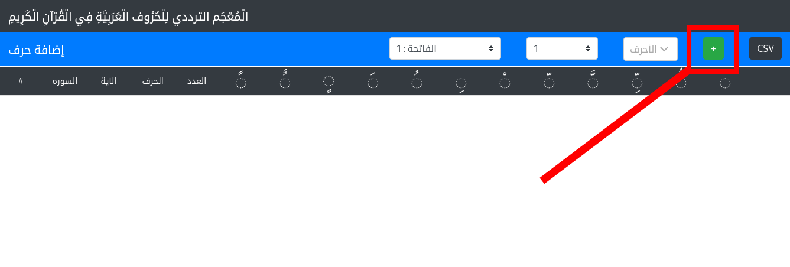

# الْمُعْجَم الترددي لِلْحُرُوف الْعَرَبِيَّةِ فِي الْقُرْآنِ الْكَرِيمِ     The Quranic letters' frequency lexicon 

#### This project is a beta version, it helps you to track frequencies of Quran characters through a multidimensional view, and one of [PyQuran](https://github.com/hci-lab/PyQuran) applications.

# How to use
the (APP)[https://moroclash.github.io/Visualization-Of-Quran/]
it supports multiple filtrations based on:
1. Surah
2. Aya
3. Characters
#### So it allows you to apply any sort of filtrations in order to fit your search aspects.

#### for character filtrations, you can choose a solo character or combine any sort of characters together, and it will consider those combined characters as one letter (e.g ة,ت == one-letter), that allows you to create any systems according to your use-case or your inspiration.

#### after customized the filtrations setting, hit the add button to get the results

#### you will get the character's all shapes frequencies (with-tashkeel and without) according to the filtration settings you set.

#### Conclousion:
## This one of the Applications you can do using (PyQuran)[https://github.com/hci-lab/PyQuran], and allows you to look and meditate on something that you have not thought about before.

## References:
* (PyQuran)[https://github.com/hci-lab/PyQuran]
* We have used the Quran Corpus of (PyQuran)[https://github.com/hci-lab/PyQuran]
